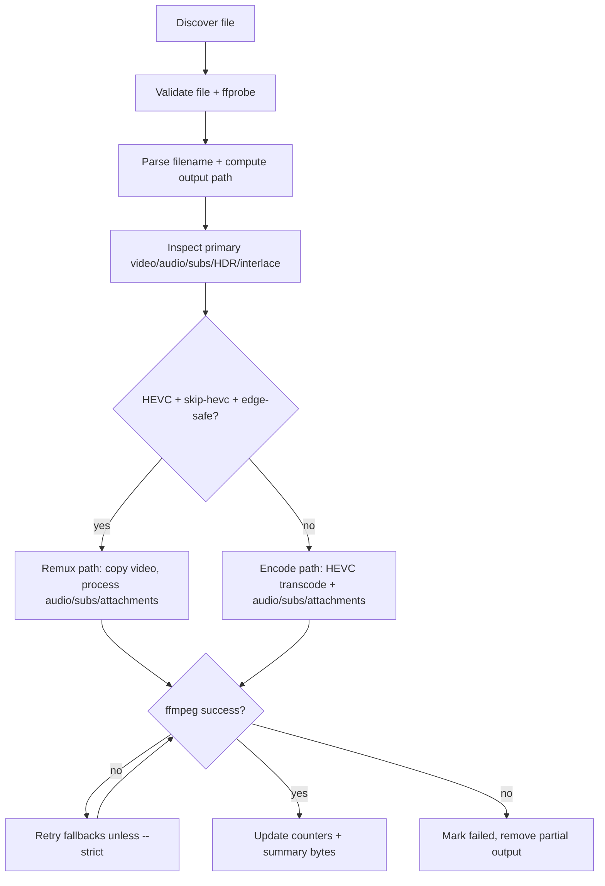

# Muxmaster Current-Behavior Design (Legacy Bash)

Status: Reverse-engineered from `Muxmaster.sh` (v1.7.0)  
Scope: Document observable current behavior for a Go rewrite

## 1) Purpose & System Overview

### What the script does
`Muxmaster.sh` is a CLI batch media processor that converts a source library into Jellyfin-friendly output:

- Video target: HEVC (`hevc_vaapi` or `libx265`)
- Audio target: preserve AAC when already AAC, otherwise transcode to AAC
- Container target: MKV (default) or MP4
- Metadata: preserves metadata and chapters

### Primary responsibilities
- Walk input directory and discover supported media files.
- Classify filename as TV or movie and build normalized output paths.
- Inspect streams with `ffprobe` (codec, bitrate, resolution, HDR/interlace, stream counts).
- Decide between:
  - **HEVC remux path** (copy video + process audio/subs/attachments), or
  - **full transcode path** (re-encode video + process audio/subs/attachments).
- Run `ffmpeg` with retry fallbacks for known mux/stream issues.
- Produce run summary (encoded/skipped/failed, aggregate size delta).

### Overall workflow model
Single-process, single-file-at-a-time batch loop with global runtime state and deterministic file order (`find ... | sort -z`).

---

## 2) Execution Model

### Entry point
- `main "$@"`
- Sequence:
  1. `init_colors`
  2. `parse_args`
  3. `init_colors` again (to apply `--color/--no-color`)
  4. banner
  5. `--check` path (`run_check`, then exit)
  6. input/output validation
  7. `check_deps`
  8. `process_files`

### CLI arguments and modes
Observed argument categories:

- **Encoder mode**: `--mode vaapi|cpu`
- **Quality controls**: `--quality`, `--cpu-crf`, `--vaapi-qp`, `--smart-quality`, `--no-smart-quality`
- **Output/container**: `--container mkv|mp4`, `--force`
- **Stream handling**: `--skip-hevc` (default on), `--no-skip-hevc`, `--no-subs`, `--no-attachments`
- **HDR/deinterlace**: `--hdr preserve|tonemap`, `--no-deinterlace`
- **Timestamp/audio behavior**: `--clean-timestamps`, `--no-clean-timestamps`, `--match-audio-layout`, `--no-match-audio-layout`
- **Runtime/UX**: `--dry-run`, `--strict`, `--show-fps`, `--no-fps`, `--no-stats`, `--color`, `--no-color`, `--verbose`, `--log`
- **Utility**: `--check`, `--version`, `--help`

`--check` mode does not require input/output positional args.

### Main control flow
- Parse and validate options.
- Validate environment (`ffmpeg`, `ffprobe`, encoder capability).
- Discover candidate files.
- Build TV year-variant index for naming harmonization.
- For each file:
  - validate/probe
  - parse filename + compute output path (+ collision remap)
  - inspect stream details
  - choose remux vs transcode
  - execute with retry policy
- Print aggregate summary.

### Batch processing strategy
- No parallelism; one file at a time.
- Deterministic ordering (sorted list).
- Counters tracked in-loop: encoded/skipped/failed + cumulative input/output bytes.
- Temp files tracked globally and cleaned by trap on exit/interrupt.

---

## 3) Media Processing Pipeline (Per File Lifecycle)

### Discovery
- Search rooted at `INPUT_DIR`.
- Supported extensions: `mkv|mp4|avi|m4v|mov|wmv|flv|webm|ts|m2ts|mpg|mpeg|vob|ogv` (case-insensitive).
- Prunes directories named `extras` (case-insensitive).

### Filename normalization/parsing
- `parse_filename` runs ordered regex rules (first match wins) for TV/movie detection.
- Handles multiple anime/fansub patterns (`SxxEyy`, `1xYY`, `Show - 05`, grouped releases, OP/ED/PV/specials, etc.).
- Cleans common release tags, strips bracket metadata, title-cases names, applies fallback names.
- For TV, optional harmonization with year-tag variants (`TV_SHOW_YEAR_VARIANTS`) to avoid split naming.

### Media inspection (`ffprobe`)
- Validates readable file, minimum size threshold, and probeability.
- Detects:
  - primary video stream index (ignores attached pictures),
  - codec/profile/pixel format,
  - resolution and bitrate,
  - audio stream count/codecs/channels,
  - subtitle codecs (including bitmap detection),
  - interlace field order,
  - HDR indicators via color metadata.

### Decision logic
- If `--skip-hevc` and primary codec is HEVC:
  - allow remux only when profile/pix_fmt is browser-safe (`main|main10` + `yuv420p|yuv420p10le`);
  - otherwise force full re-encode.
- Existing-output skip is enabled by default (`SKIP_EXISTING=true`), disabled by `--force`.

### FFmpeg invocation strategy
- **Remux path**:
  - `-c:v copy`, audio plan from `build_audio_opts`, optional subs/attachments, metadata/chapters copied.
- **Encode path**:
  - VAAPI: `hevc_vaapi -qp <selected>`
  - CPU: `libx265 -crf <selected> -preset <selected>`
  - optional filter chain (deinterlace, HDR tonemap, VAAPI upload formatting)
  - same audio/subtitle/attachment + metadata/chapter handling patterns as remux path.
- For MP4: add `-movflags +faststart` and `-tag:v hvc1`.

### Output naming and placement
- TV: `<OUTPUT_DIR>/<Show>/Season <NN>/<Show> - S<NN>E<NN>.<container>`
- Movie: `<OUTPUT_DIR>/<Movie or Movie (Year)>/<Movie or Movie (Year)>.<container>`
- In-run output collisions are remapped to `... - dupN.<ext>` via owner map.

### Skip/idempotency behavior
- Existing output file skip (unless `--force`).
- Dry-run mode logs intended action only; does not execute ffmpeg.
- Retry fallbacks can progressively disable attachments/subtitles or alter mux/timestamp options.

---

## 4) Functional Breakdown

| Area | Responsibility | Inputs / Outputs | Side Effects | Dependencies / Shared State |
|---|---|---|---|---|
| CLI + config (`parse_args`, defaults) | Populate runtime settings | CLI args -> global vars | exits on invalid args | global config vars |
| Logging/UI (`log_*`, colors, banner) | Timestamped console/file logs | level/message | writes stdout/stderr/log file | `LOG_FILE`, color globals |
| Environment checks (`check_deps`, `run_check`) | Verify tools/encoder capability | runtime env -> pass/fail | exits on failure (`check_deps`) | `ffmpeg`, `ffprobe`, VAAPI device |
| Probe helpers (`get_*`, `detect_hdr_type`, `is_interlaced`) | Extract stream/media attributes | input file -> scalar values | none | `ffprobe` |
| Audio/subtitle planning (`build_audio_opts`, `build_subtitle_opts`) | Build stream mapping/codec opts | input + flags -> ffmpeg arg string | warnings for incompatible subtitle cases | globals (`KEEP_*`, `AUDIO_*`, container mode) |
| Filter/quality planning (`build_video_filter`, `compute_smart_quality_settings`) | Build filter chain and selected quality values | input + global mode -> values | logs in some cases | HDR/deinterlace settings, smart-quality globals |
| Execution wrappers (`run_encode_attempt`, `run_remux_attempt`, `run_ffmpeg_logged`) | Assemble and execute ffmpeg commands | planned params -> exit code | executes ffmpeg, writes error temp files | `FFMPEG_*` globals |
| File naming/routing (`parse_filename`, `get_output_path`, collision resolver) | Derive media identity and output path | filename/path -> output path | updates collision owner maps | parse globals + associative arrays |
| Batch orchestration (`process_files`, `encode_file`) | Per-file loop, retries, counters, summary | input tree -> run results | creates dirs/files, deletes partial outputs | many globals and counters |

---

## 5) FFmpeg Strategy

### Codec decisions
- Video:
  - VAAPI mode: `hevc_vaapi`, QP-based.
  - CPU mode: `libx265`, CRF-based, preset-controlled.
- Audio:
  - If no audio: `-an`.
  - If all audio streams are AAC: copy all.
  - Mixed codecs: per stream, copy AAC streams, transcode non-AAC streams to AAC (`48kHz`, target bitrate, channel cap).

### Stream mapping rules
- Explicitly maps selected primary video stream (`-map 0:<video_index>`).
- Maps audio/subtitles/attachments conditionally.
- Applies `-dn` (drop data streams).
- Sets default dispositions:
  - video stream 0 default
  - audio stream 0 default
  - other audio streams non-default.
- Preserves metadata and chapters (`-map_metadata 0 -map_chapters 0`).

### Subtitle handling
- Controlled by `KEEP_SUBTITLES` and retry fallbacks.
- MKV: copy subtitle streams.
- MP4:
  - text subtitles -> `mov_text`
  - if any bitmap subtitles detected, subtitles are skipped (with warning).

### Hardware acceleration
- VAAPI mode initializes hardware device and filter hardware context.
- Startup capability test prefers HEVC main10 (`p010`), falls back to main 8-bit (`nv12`) if needed.

### Bitrate/quality logic
- Smart quality adjusts per file based on resolution + source bitrate curves.
- Manual quality overrides bypass smart selection.
- Additional quality retry pass (max 2 passes total) when output becomes larger than source (>105%) and smart quality is active without manual override.

### Error handling patterns
- Up to 4 retries for known ffmpeg failure signatures (unless `--strict`):
  1. drop attachments
  2. drop subtitles
  3. increase mux queue (`4096 -> 16384`)
  4. enable timestamp fix (`-fflags +genpts+discardcorrupt`, `-avoid_negative_ts make_zero`)
- On final failure: log tail of ffmpeg stderr, delete partial output.

---

## 6) State & Error Model

### Global variables
Major global state categories:
- Config: encoder mode, quality defaults, container, audio targets, feature flags.
- Runtime UX: verbosity, logging, color mode, progress options.
- Parse/output state: `MEDIA_TYPE`, `SHOW_NAME`, `SEASON`, `EPISODE`, `MOVIE_NAME`, `YEAR`, `RESOLVED_OUTPUT_PATH`.
- Maps/collections:
  - `TEMP_FILES`
  - `TV_SHOW_YEAR_VARIANTS`
  - `OUTPUT_PATH_OWNERS`
  - `OUTPUT_PATH_COLLISION_COUNTER`

### Failure handling
- Uses explicit return-code checks (no `set -e`).
- Fatal startup/config errors: `exit 1`.
- Per-file failures: counted and processing continues.
- Temp files cleaned by trap (`EXIT INT TERM`).

### Exit codes
- `0`: normal completion, including `--check` mode path.
- `1`: invalid args, bad mode/container/HDR option, missing dirs/deps/device, path safety violations, and similar startup failures.
- Per-file ffmpeg failures do not force non-zero final exit in batch mode.

### Logging behavior
- Structured timestamped levels: INFO, SUCCESS, WARN, ERROR, RENDER, OUTLIER, DEBUG.
- ERROR logs go to stderr; others to stdout.
- Optional log file mirrors uncolored messages.
- Verbose mode elevates ffmpeg loglevel and enables debug detail.

---

## 7) Structural Weaknesses (Observed)

- **Tight coupling through globals**: most functions consume/modify shared process-wide state.
- **Large monolithic file**: parsing, planning, execution, logging, and CLI all in one script.
- **Complex conditional trees**:
  - filename parsing rule chain is long and order-sensitive,
  - retry logic duplicated across remux and encode paths.
- **String-based ffmpeg arg assembly in Bash**: fragile quoting/splitting surfaces.
- **Mixed responsibilities in orchestrators** (`process_files`, `encode_file`): discovery, policy, execution, reporting all intertwined.

---

## 8) Go Rewrite Mapping (Behavior-Preserving)

### Suggested package structure
- `cmd/muxmaster` (CLI entrypoint)
- `internal/config` (defaults + CLI parsing/validation)
- `internal/logging` (leveled logger + file sink + color policy)
- `internal/probe` (`ffprobe` wrappers + typed media inspection)
- `internal/parse` (filename classification/output naming)
- `internal/pipeline` (batch orchestration and per-file lifecycle)
- `internal/ffmpeg` (command builders + executor + retry classifier)
- `internal/report` (run summary/size accounting)

### Core structs
- `Config`
- `MediaFile` (path, parsed classification, probe results)
- `OutputPlan` (resolved path, collision handling result)
- `EncodePlan` / `RemuxPlan`
- `RetryState`
- `RunStats`

### Pipeline model
- Keep current single-file lifecycle semantics and decision order.
- Represent each stage as explicit typed steps:
  1. discover
  2. validate/probe
  3. classify/name
  4. choose plan (remux vs encode)
  5. execute with fallbacks
  6. aggregate stats

### Concurrency approach
- Start with sequential processing to preserve current behavior exactly.
- Optionally introduce worker pool later behind a config flag, with deterministic log grouping and safe output-path collision handling.

### Logging and error model
- Replace implicit global logging with contextual logger passed through pipeline stages.
- Use typed errors for retry classification (attachment/subtitle/mux/timestamp) instead of regex checks spread across flow.
- Keep batch semantics: continue on per-file failure, summarize at end.
